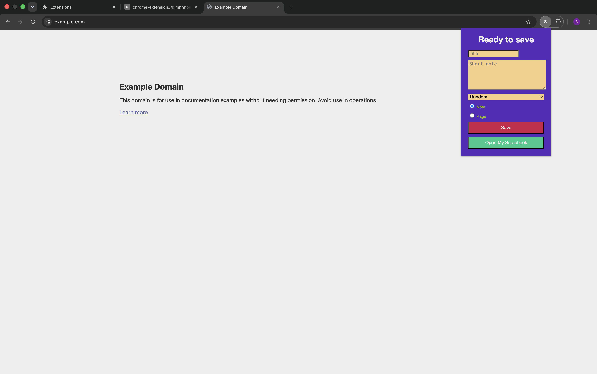
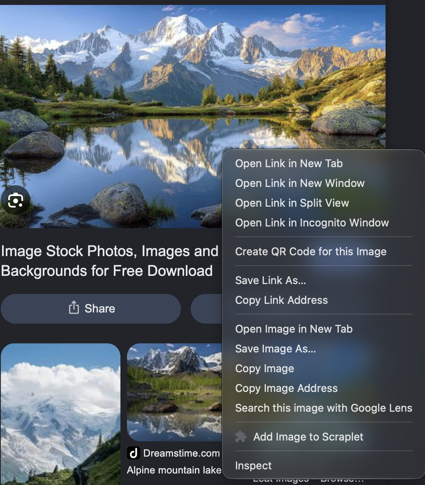
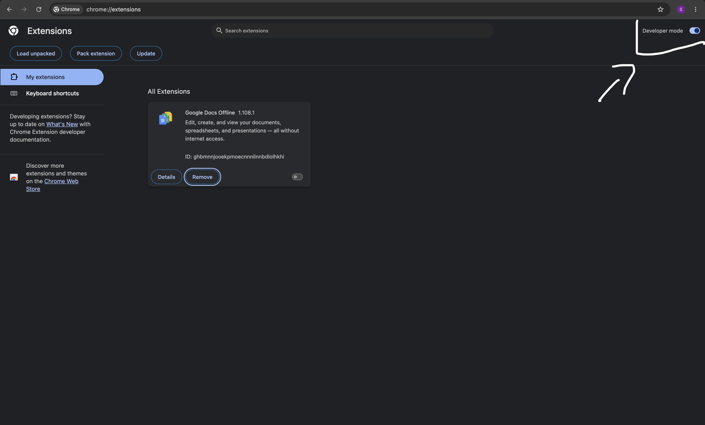
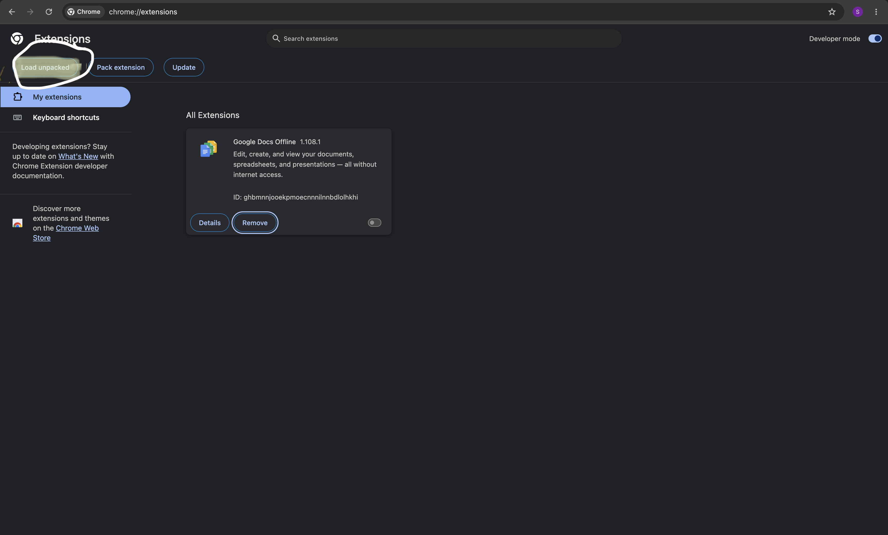
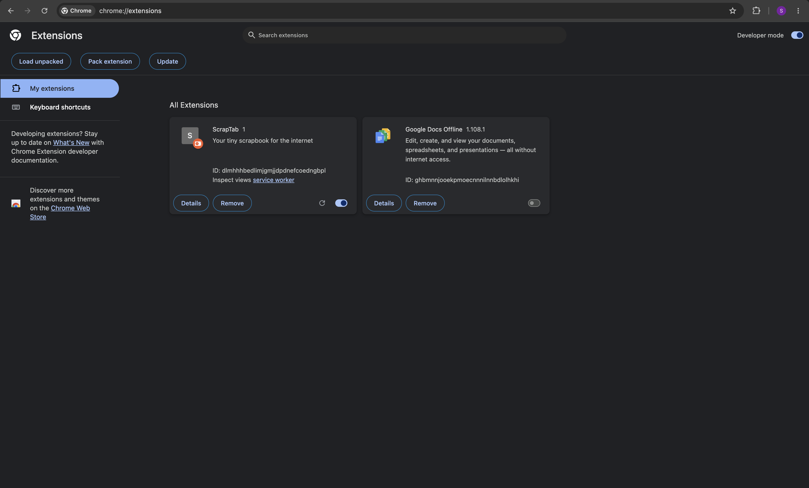

# ScrapTab

ScrapTab is a chrome extension that is very easy to use and is fun. It basically lets you add notes, pages, images and selcted text into a scrapbook. It feels really good to see all the things that interested you from one place. It is very very easy to use and minimal. The cards have distinct look based on what type they are. It is a lot of fun for me and hope it's the same for you.

## ScreenShots

Please feel free to try, it out in chrome. Unfortunately, I didn't make it for safari, sorry!

Here is a simple screenshot of an example scraptab page.

The cards look glossy and have beautiful connection to the background.

Here is how it looks when you add a note or page from the extension.

Also you can add images and selected text by right clicking on them and selecting the option that looks like below.

and same for the text.

## Getting it in your chrome

Suprisingly, it is very easy to get it in your chrome. Just follow the steps below:

- Download this project.
- Open chrome and go to this link `chrome://extensions`
- Turn on **developer mode** in the top right.

- Click **Load Unpacked**

- Select this folder.
- After the above steps it should look like this.

- Now, If you pressd on the puzzle shaped icon and pin the ScrapTab extension, it will be available in your chrome and you can use it.

- Now use it as you want and have fun.

## Note

This is my first chrome extension and I am still learning. So if you have any suggestions or feedback, I will be really happy to hear from you. Really proud of what I have made.

## AI Usage

I used AI as less possible and took assistance rather than asking it to write code for me. I used it to know, how to load extension and what files. The design and logic in the code is all Mine.
